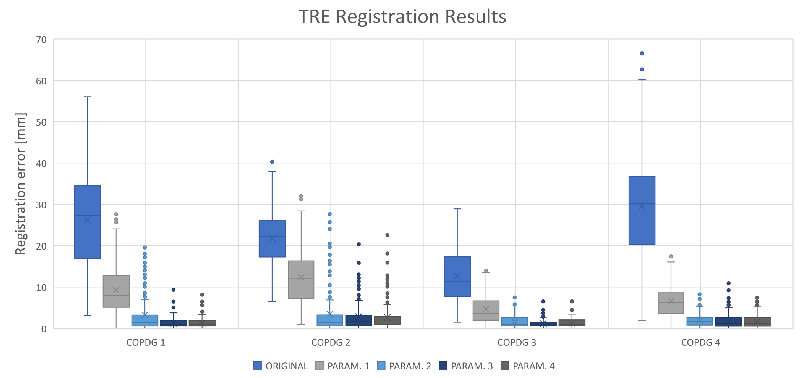

# Registration of Lung CT Images Using Elastix #

*Authors: Jhon Gomez, Sergio Tascon, Esteban Vaca*

This repository contains the information corresponding to the registration of lung CT images in exhalation and inhalation phases. Elastix is used to tackle this problem, with a special configuration specific to the problem at hand. To measure the registration results, 3D euclidean distance is used as TRE on the provided and transformed landmarks. Minimum TRE is 1.23 (1.14), 2.65 (3.13), 1.20 (1.06) and 1.59 (1.41) for images 1, 2, 3 and 4 of the provided dataset, respectively.

# Dataset #

The dataset used for training and testing the algorithm can be easily downloaded from: https://drive.google.com/drive/folders/1eQZve0v3LUAGxW2zDt5ies-hl6cbjYuV

### Requirements ###
* Elastix
* SimpleITK == 1.2.4
* pandas>=0.19  
* scipy>=0.18
* Matplotlib

### Colab Excecution ###

The present source runs embeeded in Colab using the online GPU Architecture. It is possible to run the project usng the jupyter notebook or running it directly from [Colab Link](https://colab.research.google.com/drive/1WFb6zV8AtY7p2Hh_l89n2j_vFi_7gwTl).

## Metrics ## 

The registration results are expresed as boxplot in the following image:

## Registration Results ##

The following figures presets the registration grids and overlap obained with this project:

